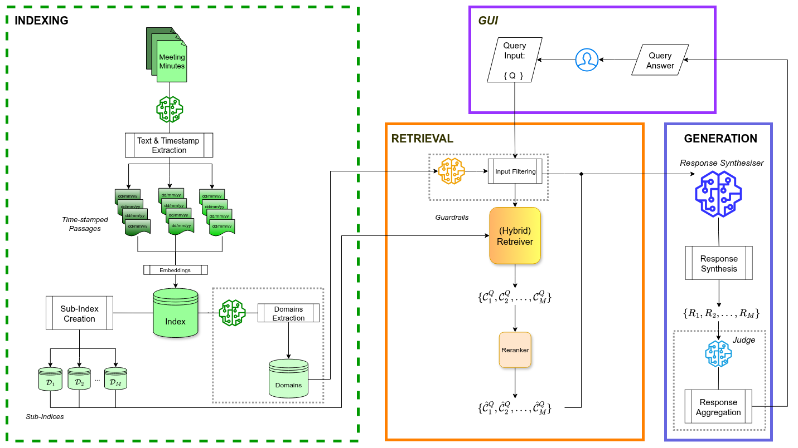

# Meeting Minutes Assistant

[](https://arxiv.org/abs/2604.14169)

A Python-based question answering system that processes and analyzes meeting minutes documents, providing context-aware
responses with temporal tracking and document source references.

## Problem Statement

In large-scale construction projects, decisions evolve, details are revised, and older decisions are replaced. All these
changes are documented in the meeting minutes held throughout the project's duration. Tracking and storing this evolving
information can be a tedious task for project managers and other professionals who need to consult these documents.

To address this challenge, we propose an application designed to streamline access to this knowledge for a specific
project. The solution is a conversational agent (or chatbot) based on Large Language Models and Retrieval-Augmented
Generation. Its purpose is to preserve the timeline of information and retrieve relevant pieces of it at specific points
in time. This is achieved using a custom information retrieval algorithm that considers both the semantic similarity of
a user's question and the date when the decision was made.

## Features



- **Document Processing & Indexing**
    - PDF document parsing via LlamaParse.
    - Vector storage using LlamaIndex.
    - Automated metadata extraction (dates, participants).
    - Support for temporal document organization.
    - French language support.

- **Input guardrails using extracted domain thematics:**
    - Automatic domain discovery from indexed documents via LLM analysis.
    - Pareto Principle (80/20) selection of most relevant thematics.
    - Real-time query validation against project scope.

- **Query Processing**
    - Natural language query understanding in French.
    - Time-aware document retrieval with customizable time steps.
    - Context-sensitive answer generation using Groq LLM.
    - Document source citations with page references.
    - Answer similarity detection to prevent redundancy.

- **User Interface**
    - Interactive gradio-based GUI with chat interface.
    - PDF document preview with source highlighting.
    - Temporal navigation of responses.
    - Predefined example queries.
    - Support for both interactive and benchmark modes.

## Architecture

### Core Components

1. **Data Processing (`app/engine/data_processing/`)**
    - `Storage`: Handles document parsing, metadata extraction, and vector storage.
    - `DataLoaders`: Manages index loading and timestamp tracking.
    - `MetadataExtractors`: Extracts dates and involved parties.

2. **Inference Engine (`app/engine/inference/`)**
    - `BaseInference`: Core temporal query functionality.
    - `GroqInference`: Implementation using Groq's LLM.
    - `Judge`: Answer similarity evaluation system.

3. **User Interface (`app/engine/gui/`)**
    - `GUI`: Gradio interface with chat and document preview.

### External Dependencies

- **LLM Services**
    - Groq API for answer generation.
    - LlamaParse for document parsing.
    - HuggingFace for embeddings.
    - ColbertRerank for answer reranking.

## Setup

### Prerequisites

- Python 3.10 or higher
- [Poetry](https://python-poetry.org/) for dependency management

### Installation

1. **Clone the repository:**
   ```bash
   git clone https://github.com/ikostis-ucl/bpc_meeting_assistant.git
   cd bpc-meeting-assistant
   ```

2. **Install dependencies using Poetry:**
   ```bash
   poetry install
   poetry lock
   ```

3. **Activate the virtual environment:**
   ```bash
   poetry shell
   ```


4. **Create environment file:**

   Create `app/assets/.env/.env` with the following API keys:
    ```
    LLAMA_PARSE_KEY=llx-...
    OPENAI_API_KEY=sk-...
    GROQ_API_KEY=gsk_...
    ```

### Usage

1. **Index Documents** *(prerequisite)*
    ```bash
    python run_kb_indexing.py
    ```

2. **Extract Domain Thematics** *(required before GUI)*
    ```bash
    python run_init_gr.py
    ```

3. **Run Interactive GUI**
    ```bash
    python run_gui.py
    ```

4. **Run BenchmarkRetrieval Tests**
    ```bash
    python run_inference.py
    ```

## Directory Structure

```
bpc_meeting_assistant/ 
├── app/ 
│ ├── assets/               # Static assets and resources 
│ ├── engine/ 
│ │ ├── data_processing/    # Document processing modules 
│ │ ├── guardrails/         # Input validation and domain filtering 
│ │ ├── gui/                # Gradio-based user interface 
│ │ └── inference/          # Query processing and LLM integration 
│ ├── scripts/              # Execution and utility scripts 
│ └── utils/                # Helper functions and utilities  
├── data/  
├── eval/                   # Evaluation and benchmarking tools  
├── resources/              # Model cache and external resources 
├── configuration.py        # Main configuration file 
├── run_gui.py              # GUI application launcher 
├── run_inference.py        # Inference benchmark runner 
├── run_init_gr.py          # Initialization script for GUI 
├── run_kb_indexing.py      # Knowledge base indexing script 
└── README.md               # This file
```

## Configuration

Key parameters in `configuration.py`:

### Data Processing

- `input_path`: Path to input documents
- `storage_dir`: Vector database location

### Embeddings

- `embeddings_model`: HuggingFace embedding model
- `embeddings_cache_dir`: Embeddings cache directory

### Guardrails

- `disable_guardrails`: Bypass input guardrails during inference (flag)
- `thematics_storage_path`: Storage path for thematics file
- `merged_thematics_storage_path`: Storage path for merged thematics file

### LLM Models (Groq)

- `groq_model_inference`: Main inference model
- `groq_model_inference_tpm`: Tokens per minute for inference
- `groq_model_inference_judge`: Model for answer similarity assessment
- `groq_model_indexing_extraction`: Model for information extraction during indexing
- `groq_model_indexing_extraction_tpm`: Tokens per minute for extraction
- `groq_model_indexing_kw`: Model for keyword extraction
- `groq_model_indexing_kw_tpm`: Tokens per minute for keyword extraction
- `groq_model_gr`: Model for guardrails
- `groq_model_gr_tpm`: Tokens per minute for guardrails

### Retrieval Settings

- `n_batch`: Number of documents processed in batch

### Deployment

- `prod`: Run in production mode (flag)
- `anon`: Run in anonymized mode (flag)
- `home_path`: Home path for GUI usage

### Benchmarking

- `benchmark_mode`: Run in benchmark evaluation mode (flag)
- `benchmark_gt_path`: Path to ground truth CSV file

## Production Deployment

For production deployment, set the following environment variables:

- `GRADIO_AUTH_PAIRS`: Comma-separated user:password pairs

Run with production flag:

```bash
python run_gui.py --prod
```
